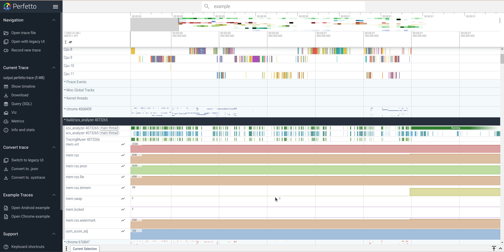

# scx-analyzer

The scx-analyzer traces SCX callback invocations and displays them in a GUI using Perfetto.

# How to build

## Prerequisites

### 1. Initialize and update the Git submodules

```console
$ git submodule init
$ git submodule update
```

### 2. Build libbpf

```console
$ cd libbpf/src
$ make DESTDIR=_INSTALL install
```

### 3. Build the Perfetto's tracebox

Follow the [Perfetto Quickstart Documentation](https://perfetto.dev/docs/quickstart/linux-tracing) for detailed instructions. Then, execute the following commands to build the Perfetto Tracebox:

```console
$ cd perfetto
$ tools/install-build-deps
$ tools/gn gen --args='is_debug=false' out/linux
$ tools/ninja -C out/linux tracebox traced traced_probes perfetto
```

After completing these steps, the *tracebox* binary will be located at *perfetto/out/linux/tracebox*.

## scheduler

To build the scheduler, run the following commands:

```console
$ cd scheduler
$ cargo build
```

## scx-analyzer

To build the scx-analyzer, use the following commands:

```console
$ cmake -B build
$ cmake --build build
```

# How to use

## Start the scheduler

Run the scheduler with the following command:

```console
$ sudo scheduler/target/debug/scheduler
[*] BPF scheduler starting!

```

## Execute the scx-analyzer

First, run *traced* in the background:

```console
$ sudo perfetto/out/linux/tracebox traced --background
$ sudo perfetto/out/linux/tracebox traced_probes --background
```

Next, execute the scx-analyzer:

```console
$ sudo build/scx_analyzer 
Starting scx-analyzer
Collecting data, CTRL+c to stop
Successfully open output file! fd=7
```

# Output

After running the scx-analyzer, an *output.perfetto-trace* file will be generated in the current directory.
To view the trace data, use the Perfetto UI. Open the file in the Perfetto Trace Viewer for a detailed visualization of the collected trace data.

SCX events are located in 'Misc Global Tracks' section and are organized into per-CPU tracks.


