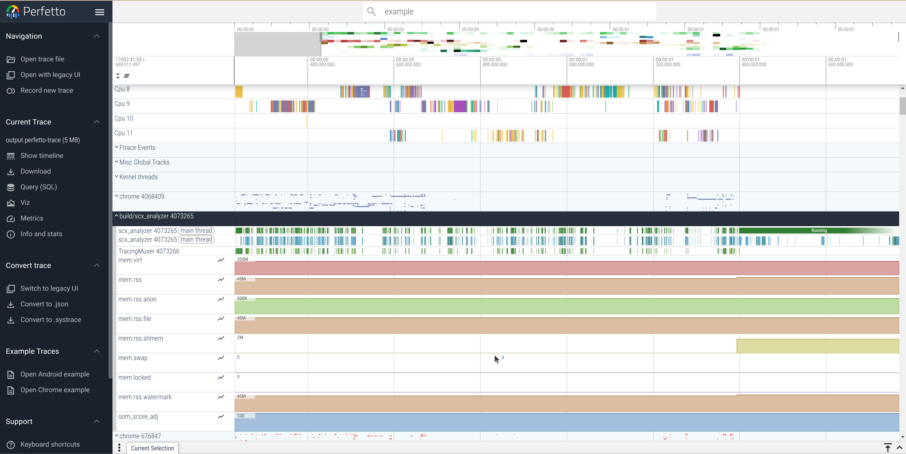

# scx-analyzer

The scx-analyzer traces SCX callback invocations and displays them in a GUI using Perfetto.

# How to build

## Prerequisites

### 0. Linux kernel

Kernel version: 6.13 or later

By dafault, the vanilla Linux kernel rejects eBPF schedulers when the `isolcpus` kernel parameter is specified.
To allow the kernel to load schedulers in such cases, you need to comment out the following code at *kernel/sched/ext.c* in the kernel source:

```diff
static int scx_ops_enable(struct sched_ext_ops *ops, struct bpf_link *link)
{
-	if (!cpumask_equal(housekeeping_cpumask(HK_TYPE_DOMAIN),
-			   cpu_possible_mask)) {
-		pr_err("sched_ext: Not compatible with \"isolcpus=\" domain isolation\n");
-		return -EINVAL;
-	}
+//	if (!cpumask_equal(housekeeping_cpumask(HK_TYPE_DOMAIN),
+//			   cpu_possible_mask)) {
+//		pr_err("sched_ext: Not compatible with \"isolcpus=\" domain isolation\n");
+//		return -EINVAL;
+//	}
```

See the source [here](https://github.com/torvalds/linux/blob/ffd294d346d185b70e28b1a28abe367bbfe53c04/kernel/sched/ext.c#L5448-L5452).

You may use the *.config* file at *kernel/.config* as the kernel build configuration.

### 1. Initialize and update the Git submodules

```console
$ git submodule init
$ git submodule update
```

### 2. Build libbpf

```console
$ cd libbpf/src
$ make DESTDIR=../../_INSTALL install
```

### 3. Build the Perfetto's tracebox

Follow the [Perfetto Quickstart Documentation](https://perfetto.dev/docs/quickstart/linux-tracing) for detailed instructions. Then, execute the following commands to build the Perfetto Tracebox:

```console
$ cd perfetto
$ tools/install-build-deps
$ tools/gn gen --args='is_debug=false' out/linux
$ tools/ninja -C out/linux tracebox traced traced_probes perfetto
```

After completing these steps, the *tracebox* binary will be located at *perfetto/out/linux/tracebox*.

## scheduler

To build the scheduler, run the following commands:

```console
$ cd scheduler
$ cargo build
```

## scx-analyzer

To build the scx-analyzer, use the following commands:

```console
$ cmake -B build
$ cmake --build build
```

# How to use

## Start the scheduler

Run the scheduler with the following command:

```console
$ sudo scheduler/target/debug/scheduler
[*] BPF scheduler starting!

```

## Execute the scx-analyzer

First, run *traced* in the background:

```console
$ sudo perfetto/out/linux/tracebox traced --background
$ sudo perfetto/out/linux/tracebox traced_probes --background
```

Next, execute the scx-analyzer:

```console
$ sudo build/scx_analyzer 
Starting scx-analyzer
Collecting data, CTRL+c to stop
Successfully open output file! fd=7
```

# Output

After running the scx-analyzer, an *output.perfetto-trace* file will be generated in the current directory.
To view the trace data, use the Perfetto UI. Open the file in the Perfetto Trace Viewer for a detailed visualization of the collected trace data.

SCX events are located in 'Misc Global Tracks' section and are organized into per-CPU tracks.


