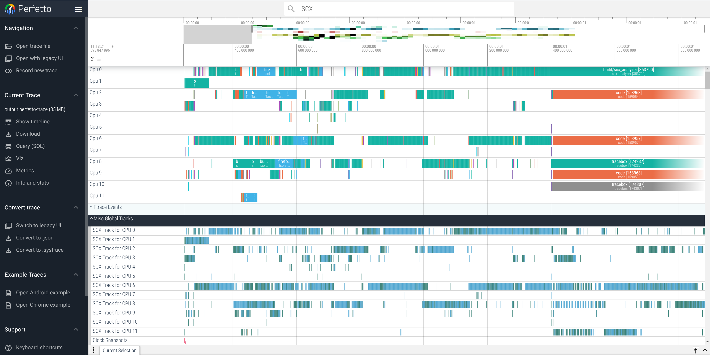

# SCX Analyzer

scx-analyzer traces scx callback invocations and display GUI using perfetto.

# How to build

## Scheduler

To build the scheduler, run the following commands:

```console
$ cd scheduler
$ cargo build
```

## SCX analyzer

To build the scx-analyzer, use the following commands:

```console
$ cmake -B build
$ cmake --build build
```

# How to use

## Start the scheduler

Run the scheduler with the following command:

```console
$ sudo scheduler/target/debug/scheduler
[*] BPF scheduler starting!

```

## Execute the SCX analyzer

First, run *traced* in the background:

```console
$ sudo tracebox traced --background
$ sudo tracebox traced_probes --background
```

Next, execute the SCX analyzer:

```console
$ sudo build/scx_analyzer 
Starting scx-analyzer
Collecting data, CTRL+c to stop
Successfully open output file! fd=7
```

# Output

After running the SCX Analyzer, an *output.perfetto-trace* file will be generated in the current directory.
To view the trace data, use the Perfetto UI. Open the file in the Perfetto Trace Viewer for a detailed visualization of the collected trace data.

SCX events are located in 'Misc Global Tracks' section and are organized into per-CPU tracks.


